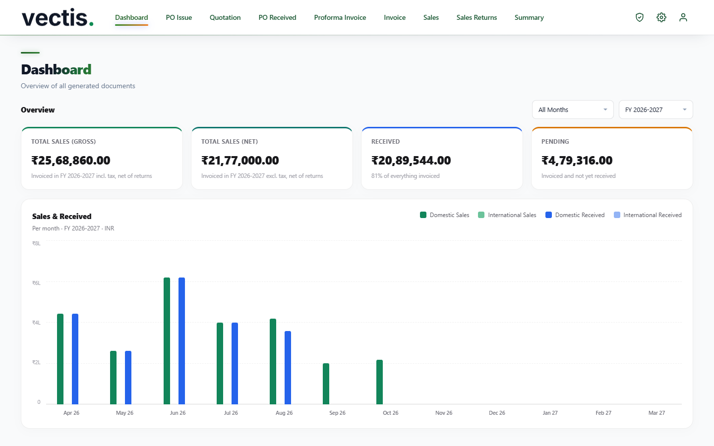
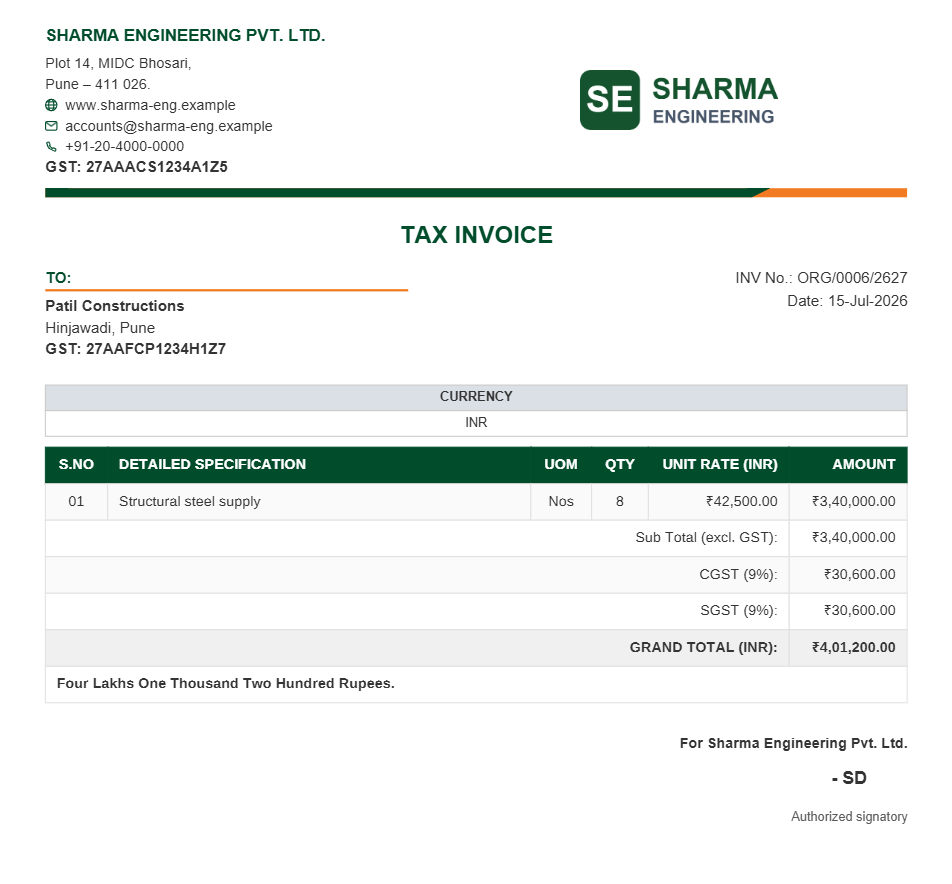
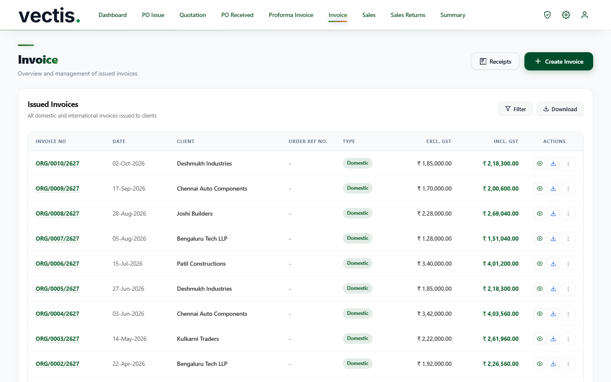
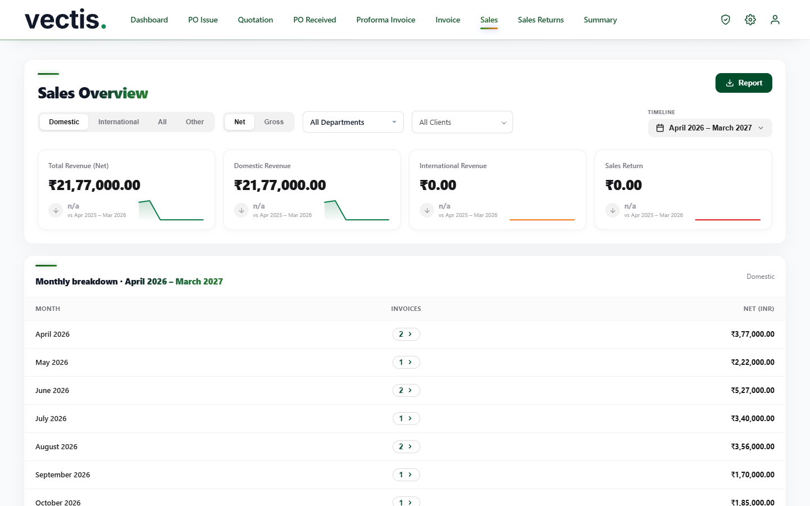
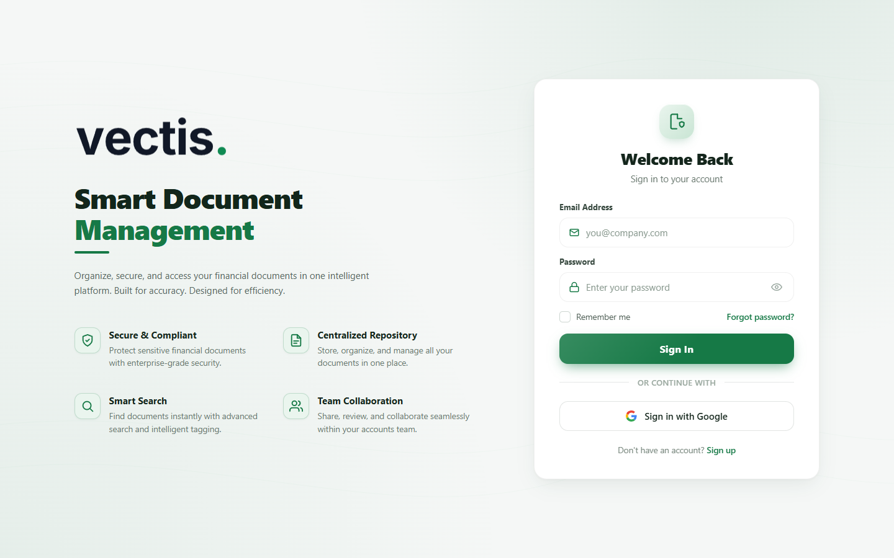

<p align="center">
  
</p>

<p align="center">
  Self-hosted GST invoicing and document management for small accounts teams.
</p>

<p align="center">
  <a href="https://github.com/Saiharshith007/vectis-erp/actions/workflows/ci.yml"></a>
  <a href="LICENSE"></a>
  
  
</p>

<p align="center">
  
</p>

Vectis handles the document side of a small Indian business's accounts:
quotations, purchase orders, proforma and tax invoices, receipts and credit
notes. It numbers everything per financial year, works out GST, prints clean
PDFs on your own letterhead, and keeps track of what has been paid.

It runs as a single Python process with no dependencies. Start it on an office
PC for a few people on the LAN, or put it on a small server behind HTTPS.

## Features

**Documents**
- Purchase orders, quotations, proforma invoices and tax invoices, exported as PDF
  with your company details, logo, signature and stamp
- Received client POs: upload the PO, capture its line items, and bill it in parts
- Receipts against invoices (including part payments and advances), credit notes
  and sales returns

**Tax and money**
- CGST + SGST or IGST, picked automatically from the company and client GSTIN
  state codes
- Export invoices in any currency, with the exchange rate recorded per invoice
- Round-off and amount in words in the Indian numbering system (lakh, crore)

**Tracking and reports**
- Dashboard of sales against money received for the financial year
- Sales register by month, department and client; outstanding summary
- PDF and Excel export of document lists and reports

**Team and data**
- Staff sign up and an admin approves them; an append-only activity log
- Bulk import of clients, suppliers and past invoices from CSV or Excel,
  including Tally Prime ledger exports
- Document numbers per financial year, with editable starting serials

## Screenshots

| Tax invoice PDF | Invoices |
| --- | --- |
|  |  |
| **Sales register** | **Sign in** |
|  |  |

The screenshots use made-up demo data.

## Quick start

You need Python 3.11 or newer. Nothing else to install.

```bash
git clone https://github.com/Saiharshith007/vectis-erp.git
cd vectis-erp
python server.py
```

Open http://127.0.0.1:8000 and sign in as `admin@example.com` with password
`admin123`. Change the password straight away (profile menu → Change password);
the server prints a warning on every start until you do.

On Windows you can double-click `run.bat` instead. It uses port 8010 and opens
the browser for you. On macOS and Linux there's `./run.sh`.

Data is stored as JSON files in `db/`. Set `DATABASE_URL` to use PostgreSQL.

## Setting it up for your company

- **Company details**: Settings → Company Header. Name, address, GSTIN, CIN,
  phone, email and website go on every PDF. Fill in the GSTIN before you
  invoice: its state code decides between CGST + SGST (client in the same
  state) and IGST.
- **Logo on documents**: upload it in the same Company Header form. It prints
  top-right on invoices, quotations, POs, receipts and reports. Any shape works;
  a wide PNG with a transparent background looks best. Without one, documents
  print with no logo. `logo.svg` is the Vectis app logo and never appears on
  documents.
- **Document number prefix**: `ORG_CODE` at the top of `js/storage.js`. The
  default `ORG` gives numbers like `ORG/0001/2627`.
- **Departments**: the `DEPARTMENTS` lists in the `js/` modules.
- Signatures, GST rates, bank accounts and serial numbers are all in Settings.

### Email verification (optional)

New users can be asked to confirm their email with a one-time code. Add your
SMTP details to `db/app_settings.json`:

```json
{
  "smtpHost": "smtp.example.com",
  "smtpPort": 587,
  "smtpUser": "no-reply@example.com",
  "smtpPassword": "...",
  "smtpFromName": "Vectis"
}
```

Without them, sign-up skips the code and goes straight to admin approval.

## Configuration

| Variable | Default | Purpose |
| --- | --- | --- |
| `VECTIS_ADMIN_EMAIL` | `admin@example.com` | Admin login |
| `VECTIS_HOST` | `127.0.0.1` | Bind address (`0.0.0.0` when TLS or `PORT` is set) |
| `VECTIS_PORT` / `PORT` | `8000` | Listen port (`443` when a certificate is present) |
| `DATABASE_URL` | unset | PostgreSQL connection string; needs `pip install -r requirements.txt` |
| `SUPABASE_URL`, `SUPABASE_SERVICE_KEY`, `SUPABASE_BUCKET` | unset | Keep uploaded and generated files in a Supabase Storage bucket |
| `VECTIS_CERT`, `VECTIS_KEY` | `certs/cert.pem`, `certs/key.pem` | Serve HTTPS directly when both exist |
| `VECTIS_SAVE_ROOTS` | unset | Only allow server-side PDF/backup writes inside these folders |
| `VECTIS_UPLOAD_EXTS` | pdf, images, office files, csv, txt | Allowed upload extensions |

Login throttling and POST rate limits can be tuned with `VECTIS_LOCK_*` and
`VECTIS_POST_RATE_*` (see `server.py`).

## How it works

- **Server**: `server.py` is a single file on Python's standard library
  (`http.server`). It handles sign-in and sessions, the JSON API and static
  files. Records go to JSON files in `db/` or to PostgreSQL; uploaded and
  generated PDFs go to `uploads/` or a Supabase Storage bucket.
- **Front end**: plain JavaScript with no build step, one module per screen in
  `js/`, loaded by `index.html`. PDFs are generated in the browser with jsPDF,
  pdf.js handles uploaded PDFs, and SheetJS reads and writes Excel files.
- **Working together**: documents are saved as per-item changes and serial
  numbers are handed out by the server, so two people working at the same time
  don't overwrite each other's work or get the same invoice number.

```
server.py         HTTP server, auth, sessions, persistence
index.html        the single-page UI
js/               one module per screen, plus storage, auth and PDF helpers
css/styles.css
deploy/           Caddyfile and systemd unit
docs/             deployment guide and screenshots
run.bat, run.sh   local launchers
*.ps1             Windows backup and firewall helpers
```

## Deployment

[docs/deployment.md](docs/deployment.md) covers a Windows PC on an office LAN, a
Linux VM behind Caddy, and Render with Postgres. Read [SECURITY.md](SECURITY.md)
before exposing it to the internet.

## Development

The same checks run in CI on every push:

```bash
python test_server_logic.py
npx eslint@8 js assets
```

See [CONTRIBUTING.md](CONTRIBUTING.md) for the ground rules, and
[CHANGELOG.md](CHANGELOG.md) for what changed between releases.

## License

[MIT](LICENSE)
